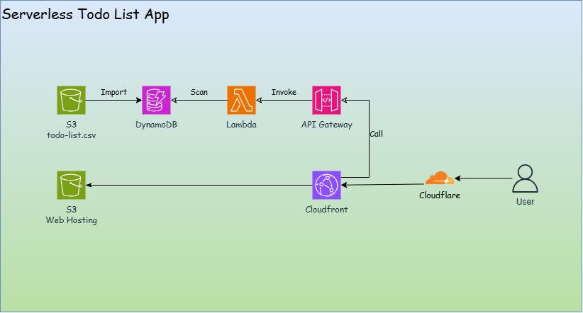

# Project Overview

- Project Name: Todo List App
- Features:

  - Serverless
  - Cloud Native
  - IaC
  - CICD

- Technologies Used

  - `Terraform`: Infrastructure as Code (IaC) tool for provisioning and managing cloud resources.
  - AWS Services:
    - `S3`: Hosting static website and storing todo list data.
    - `Lambda`: Serverless functions for backend logic and API integration.
    - `API Gateway`: Exposing Lambda functions as RESTful APIs.
    - `CloudFront`: Content Delivery Network (CDN) for caching and faster content delivery.
    - `Cloudflare`: DNS management and additional CDN capabilities.
    - `GitHub Actions`: Controlling the CICD pipeline for automated deployment.

- Architecture



- Important Note: Command for Lambda layers

```sh
# the following is what should be the python dir, according to the document.
# python/              # Required top-level directory
# └── requests/
# └── boto3/
# └── numpy/
# └── (dependencies of the other packages)

# package dependencies, pwd is terraform/
pip install -r ../lambda/requirements.txt --platform manylinux2014_x86_64 --only-binary=:all: -t ../lambda/python --upgrade

# power shell: zip file
Compress-Archive -Path ../lambda/python -DestinationPath ../lambda/layer.zip -Force
```
